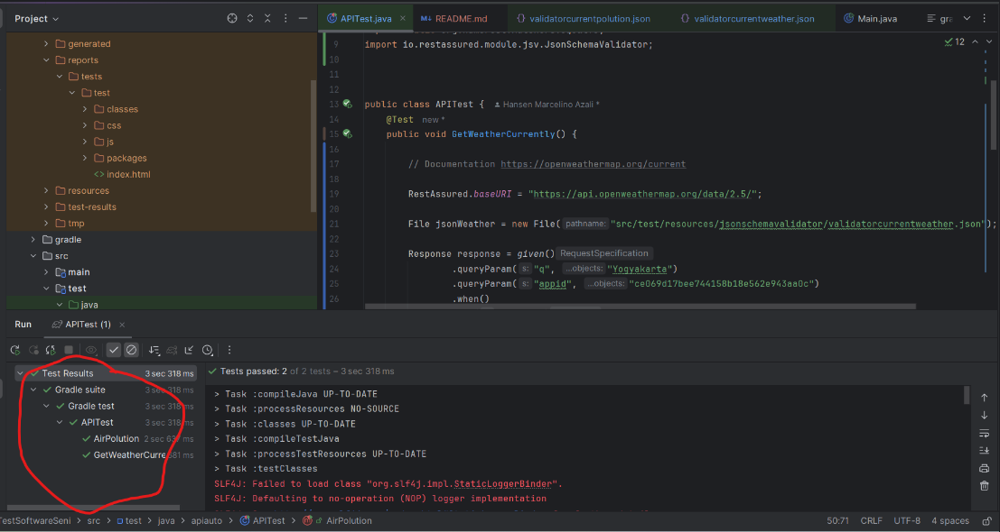
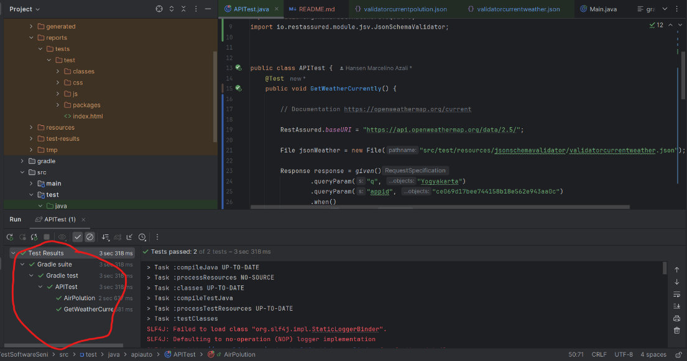

How to run the code

--> running with cmd "gradle test" to run all code and then the code will generate new folder,

new folder name "build" and you can find report folder there. Run index.html if u want to see the result.

Appid= a70f19e2049f77baf708585425a9d4da
AppID = ce069d17bee744158b18e562e943aa0c

****Result****

